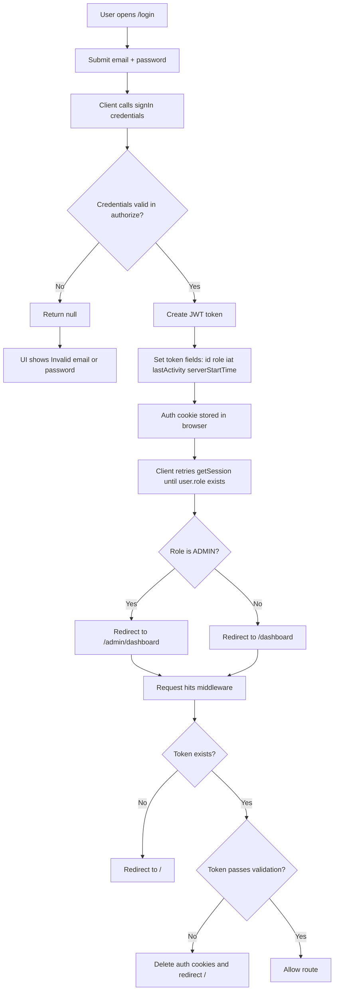
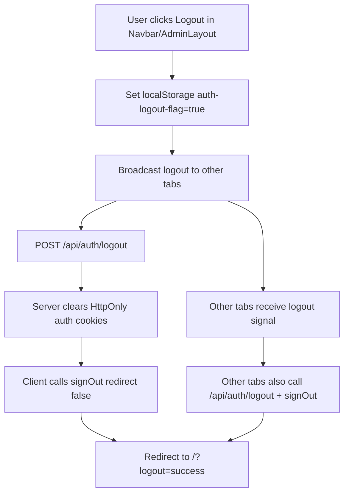
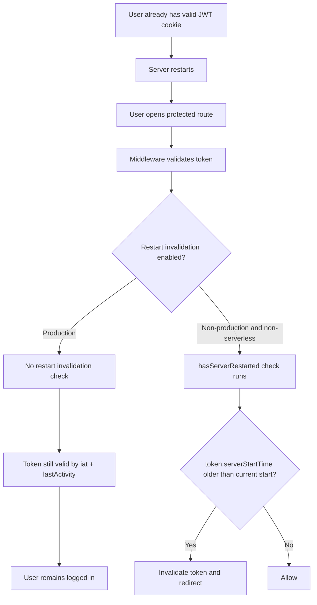

# Admin Auth Control Flow Diagrams

This file breaks the auth flow into separate, readable diagrams:
- Admin login flow
- Admin logout flow
- Why session can survive server restart

---

## 1) Admin Login Flow

Light code anchors:
- `src/app/login/page.tsx`
- `src/lib/auth.ts`
- `src/middleware.ts`

---

## 2) Admin Logout Flow

Light code anchors:
- `src/components/ui/navbar.tsx`
- `src/components/admin/AdminLayout.tsx`
- `src/components/dashboard/DashboardLayout.tsx`
- `src/components/providers/LogoutSync.tsx`
- `src/app/api/auth/logout/route.ts`

---

## 3) Why You Stay Logged In After Server Restart

Current behavior in your code:
- Restart-based forced logout is disabled in production.
- Session validity depends on:
  - max age (24h)
  - inactivity timeout (10m, refreshed by activity updates)

Key files:
- `src/lib/auth.ts`
- `src/middleware.ts`
- `src/lib/server-start-time.ts`

---

## Plain-Language Summary

- Login succeeds -> JWT cookie is created -> middleware allows protected routes while token is valid.
- Logout works by clearing cookies server-side and syncing logout across tabs.
- Server restart does **not** currently force logout in production, so existing JWT cookies can continue to work until timeout rules expire.
